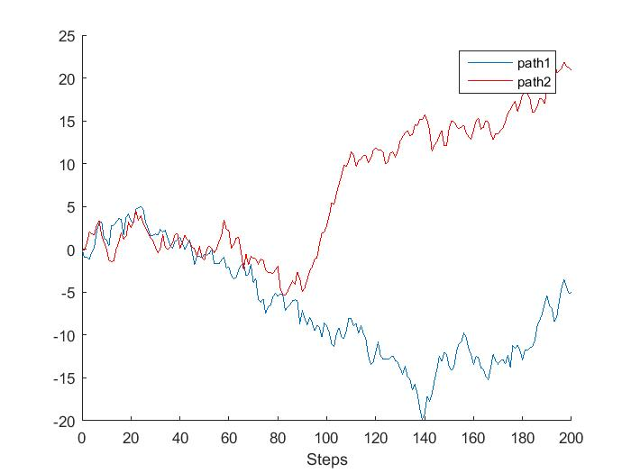

% Simulation of Brownian Motion Paths
% Daniel Dimitrov, Tilburg University
% Numerical Simulation, Assignment 2


Introduction
================

----------------------
Bownian Motion, also known as a Wiener process, is a foundational block in quantitative finance. It is used extensively for pricing of derivative products, risk management and Hedging, Portfolio Construvtion
----------------------

Definition
-----------

A *Wiener process* ${W_t}$ in continous time satisfes the following properties for $t\geq0$.

(i)  $W_0 = 0$.
    
(ii)  If $t_1<t_2\leq t_3<t_4$, then the increments $W_t_2-W_t_1$ and $W_t_4 - W_t_3$ are independent.
    
(ii)  For any given $t_1$ and $t_2$ with $t_2 > t_1$, the increment $W_t_2-W_t_1$ is normally distributed with mean $0$ and variance $t_2-t_1$.

Details are available in the course script Financial Models by Prof. Dr. J.M.Schumacher.

----------------------

Assignment Part A 
=================

Problem:
-----------

Plot two sample paths of a discrete-time standard random walk. That is, plot
two trajectories of the process defned by the recursion $X_{k+1} = X_k + Z_k$ where
$X_0 = 0$ and the $Z_k$'s are independent standard normal variables. Take 200 steps.

Solution MATLAB Code:
---------

The MATLab function $cumsum$ is used which helps avoid generating a time loop. The code is provided below. 

```
N=200; %number of steps
%initial values for the paths

path1(1)=0;
path2(1)=0;

%generating the paths
path1(2:N+1)=cumsum(randn(N,1));
path2(2:N+1)=cumsum(randn(N,1));

%output
figure 
hold on
plot([0:1:200],path1)
plot([0:1:200],path2,'r')
xlabel('Steps')
legend('path1','path2')
```

Solution Graph:
----------

The output graph is provided below



----------------------

Assignment Part B 
=================

Problem:
----------

Let $W_t$ be a Wiener process. Show that 

$$cov(W_t_1 ;W_t_2) = min(t_1; t_2)$$

For every step in your reasoning, indicate which property of the Wiener process you use.

Solution:
----------

Assume that $t_0 < t_1 < t_2$ where $t_0=0$. Then we can consider $W_t_1 = W_t_1 −W_t_0$ and $W_t_2$ as $W_t_2=(W_t_1-W_t_0)+(W_t_2-W_t_1)$ where $W_t_0=0$ from property (i) of a Wiener process. 

We wrote each of the random variables of the process as an increment. 
Those increments are independent (ii) and normally distributed (iii), with zero mean and variance that is equal to the time interval between the two random variables. 

So, if $W_t_0=0$, $W_t_1\sim N(0,t_1)$ and $W_t_2-W_t_1\sim N(0,t_2-t_1)$

The sum of two independent and normally distributed random variables is still a random variable, 
which is normally distributed with variance the sum of the variances of the aforementioned random 
variables:  $$W_t_2\sim N(0,t_2)$$

As a result, $$Cov(W_t_1,W_t_2)
            =E(W_t_1W_t_2)-E(W_t_1)E(W_t_2)
            =E(W_t_1W_t_2)=E(W_t_1(W_t_1+(W_t_2-W_t_1))
            =E((W_t_1)^2)+E((W_t_1(W_t_2-W_t_1))
            =E((W_t_1)^2)+E(((W_t_1-W_t_0)(W_t_2-W_t_1))
            =E((W_t_1)^2)=Var(W_t_1)=t_1$$

Analogously, if $0=t_0<t_2<t_1$, then $Cov(W_t_1,W_t_2)=E(W_t_2^2)=t_2$.

Consequently, $Cov(W_t_1,W_t_2)=min(t_1,t_2)$.
